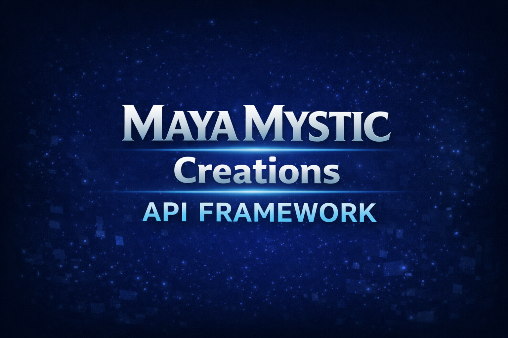

<h1 align="center">Maya Mystic Creations</h1>
<h3 align="center">API Framework</h3>

Enterprise-Grade API Networking Framework for Unity

🚀 MayaMystic API Framework
<h1 align="center">🚀 MayaMystic API Framework</h1> 
  
 
 <b>Enterprise-grade middleware-based API networking framework for Unity</b> 
 

 
 <h2>📑 Table of Contents</h2> <ul> <li><b><a href="#-overview">📌 Overview</a></b></li> <li><b><a href="#-quick-start">⚡ Quick Start</a></b></li> <li><b><a href="#-key-features">✨ Key Features</a></b></li> <li><b><a href="#-architecture">🧠 Architecture</a></b></li> <li><b><a href="#-api-request-lifecycle">🔄 API Request Lifecycle</a></b></li> <li><b><a href="#-core-components">⚙ Core Components</a></b></li> <li><b><a href="#-package-information">📦 Package Information</a></b></li> <li><b><a href="#-package-structure">📁 Package Structure</a></b></li> <li><b><a href="#-documentation">📚 Documentation</a></b></li> <li><b><a href="#-samples">🧪 Samples</a></b></li> <li><b><a href="#-roadmap">🗺 Roadmap</a></b></li> <li><b><a href="#-changelog">📜 Changelog</a></b></li> <li><b><a href="#-license">📄 License</a></b></li> <li><b><a href="#-author">👤 Author</a></b></li> </ul> 
 <h2>📌 Overview</h2> 
 <b>MayaMystic API Framework</b> is a production-ready networking SDK for Unity. 
 
 It introduces a <b>middleware pipeline architecture</b> allowing developers to build scalable API systems with clean architecture. 
 <h3>Built-in solutions include</h3> <ul> <li>Authentication</li> <li>Logging</li> <li>Retry strategies</li> <li>Endpoint resolution</li> <li>Request lifecycle management</li> </ul> 
 <h2>⚡ Quick Start</h2> 
 
<b>Click to expand installation steps</b>
   <h3>1️⃣ Install via Git</h3> 
Open <b>Unity Package Manager</b>
 <pre> Window → Package Manager </pre> 
Click
 <pre> + → Add package from Git URL </pre> 
Paste
 <pre> https://github.com/HarshPatel19011995/API-Framework-Plugin.git#v1.1.0 </pre> 
 <h3>2️⃣ Create ApiManager</h3>
var apiManager = new ApiManager();

 <h3>3️⃣ Register Middleware</h3>
apiManager.UseMiddleware(new LoggingMiddleware());
apiManager.UseMiddleware(new AuthMiddleware(tokenProvider));
apiManager.UseMiddleware(new SmartRetryMiddleware());

 <h3>4️⃣ Execute API Request</h3>
await handler.ExecuteAsync();

 
 <h2>✨ Key Features</h2> <table> <tr> <th>Feature</th> <th>Description</th> </tr> <tr> <td><b>Async ApiManager</b></td> <td>Centralized API request execution</td> </tr> <tr> <td><b>Middleware Pipeline</b></td> <td>Modular request processing</td> </tr> <tr> <td><b>Authentication Middleware</b></td> <td>Automatic Bearer token injection</td> </tr> <tr> <td><b>Smart Retry System</b></td> <td>Handles transient network failures</td> </tr> <tr> <td><b>Token Provider</b></td> <td>Abstract token management</td> </tr> <tr> <td><b>Endpoint Resolver</b></td> <td>Flexible API endpoint configuration</td> </tr> <tr> <td><b>JSON Serialization</b></td> <td>Powered by Newtonsoft JSON</td> </tr> </table> 
 <h2>🧠 Architecture</h2> 
 
<b>View Architecture Diagram</b>
   <pre> ApiHandler ↓ ApiManager ↓ Middleware Pipeline ├── LoggingMiddleware ├── AuthMiddleware ├── SmartRetryMiddleware ↓ HttpClient ↓ Remote Server </pre> <h3>Benefits</h3> <ul> <li>Clean separation of concerns</li> <li>Extensible networking architecture</li> <li>Middleware driven request lifecycle</li> <li>Production-ready scalability</li> </ul> 
 
 <h2>🔄 API Request Lifecycle</h2> 
 
<b>View Request Lifecycle</b>
   <pre> Client Code ↓ ApiHandler ↓ ApiManager ↓ Middleware Processing ↓ HTTP Request ↓ Server Response ↓ JSON Deserialization ↓ Typed Model ↓ Result Returned </pre> 
 
 <h2>⚙ Core Components</h2> <h3>🔹 ApiManager</h3> 
Responsible for executing API requests.
 <h4>Features</h4> <ul> <li>Async request execution</li> <li>Request timeout handling</li> <li>Cancellation support</li> <li>Middleware-driven request processing</li> </ul>

Example:

var apiManager = new ApiManager();

 <h3>🔹 Middleware Pipeline</h3>
apiManager.UseMiddleware(new LoggingMiddleware());
apiManager.UseMiddleware(new AuthMiddleware(tokenProvider));
apiManager.UseMiddleware(new SmartRetryMiddleware());

Supported middleware:

<ul> <li>Logging Middleware</li> <li>Authentication Middleware</li> <li>Retry Middleware</li> <li>Custom Middleware</li> </ul> 
 <h3>🔹 Smart Retry Middleware</h3> <pre> Retry status codes 408 500 502 503 504 </pre> <pre> Retry strategy Attempt 1 → 500ms Attempt 2 → 1000ms Attempt 3 → 2000ms </pre> 
 <h3>🔹 Authentication Middleware</h3> <pre> Authorization: Bearer &lt;token&gt; </pre>

Supported token types:

<ul> <li>Static API keys</li> <li>JWT tokens</li> <li>Runtime tokens</li> <li>Persisted tokens</li> </ul> 
 <h3>🔹 Token Provider</h3>
public interface ITokenProvider
{
    string GetToken();
}

Example implementation:

public class StaticTokenProvider : ITokenProvider
{
    private readonly string token;

    public StaticTokenProvider(string token)
    {
        this.token = token;
    }

    public string GetToken() => token;
}

 <h3>🔹 Endpoint Resolver</h3>
public interface IApiEndpointResolver
{
    string GetFullUrl(string endpointKey);
}

Example:

public class ProjectApiConfig : ScriptableObject, IApiEndpointResolver
{
    public string BaseUrl;
    public string Login;

    public string GetFullUrl(string endpointKey)
    {
        return endpointKey switch
        {
            nameof(Login) => BaseUrl + Login,
            _ => string.Empty
        };
    }
}

 <h2>📦 Package Information</h2> <table> <tr> <th>Property</th> <th>Value</th> </tr> <tr> <td>Package Name</td> <td><code>com.mayamystic.apiframework</code></td> </tr> <tr> <td>Version</td> <td><b>1.1.0</b></td> </tr> <tr> <td>Minimum Unity Version</td> <td>2021.3 LTS</td> </tr> <tr> <td>Dependency</td> <td>com.unity.nuget.newtonsoft-json</td> </tr> <tr> <td>License</td> <td>Proprietary – MayaMystic</td> </tr> </table> 
 <h2>📁 Package Structure</h2> <pre> Runtime/ ├── Core/ │ ├── Network/ │ ├── Middleware/ │ ├── Interfaces/ │ ├── Utilities/ │ └── Base/ Samples~/ Documentation~/ </pre> 
 <h2>📚 Documentation</h2> 
 Full documentation available here 
 
 👉 https://harshpatel19011995.github.io/API-Framework-Plugin/ 

Includes:

<ul> <li>Getting Started</li> <li>Architecture Overview</li> <li>Middleware System</li> <li>Authentication System</li> <li>Smart Retry System</li> <li>API Reference</li> </ul> 
 <h2>🧪 Samples</h2> <pre> Samples~/BasicUsage </pre>

Demonstrates:

<ul> <li>Creating ApiManager</li> <li>Registering middleware</li> <li>Performing API requests</li> </ul> 
 <h2>🗺 Roadmap</h2> <table> <tr> <th>Version</th> <th>Planned Features</th> </tr> <tr> <td>v1.2</td> <td>Token refresh middleware</td> </tr> <tr> <td>v1.2</td> <td>Environment configuration</td> </tr> <tr> <td>v1.3</td> <td>Request logging abstraction</td> </tr> <tr> <td>v1.4</td> <td>API metrics system</td> </tr> <tr> <td>v2.0</td> <td>Plugin transport architecture</td> </tr> </table> 
 <h2>📜 Changelog</h2> 
 https://github.com/HarshPatel19011995/API-Framework-Plugin/blob/main/CHANGELOG.md 
 
 <h2>📄 License</h2> 
 Proprietary – MayaMystic  All rights reserved. 
 
 <h2>👤 Author</h2> 
 <b>Harsh Patel</b>  MayaMystic 
 
 GitHub  https://github.com/HarshPatel19011995 
 
 <h2>⭐ Contributing</h2> 
 Currently maintained internally.  External contributions may be accepted in future releases. 

